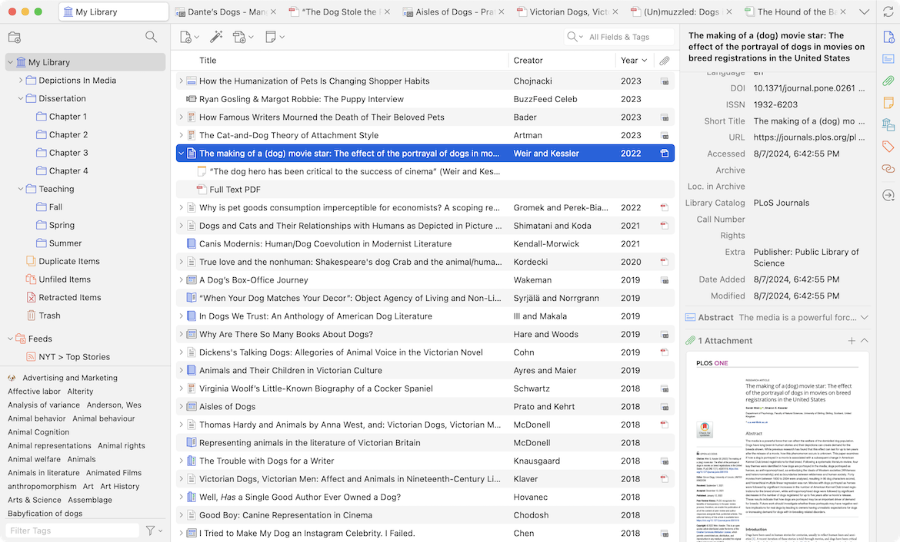

# Bibliographies

!!! Note
    **TLDR:** Zotero is recommended if you are using multiple pieces of software or collaborating with others. JabRef is 
    recommended if you are just using LaTeX and BibTeX/BibLaTeX.

## Reference Management

Only two tools will be discussed here, as they are the most popular and widely used. Alternatives are available,
but I do not have enough experience with them to provide a fair comparison.

### [Zotero](https://www.zotero.org/)

!!! Note
    For the best experience, use the [Better BibTeX](https://retorque.re/zotero-better-bibtex/) extension.

Zotero is a free, open-source, cross-platform reference management software that is available for Windows, macOS, and 
Linux. It is a versitle and powerful tool that can be used to manage your references, generate citations, and create 
bibliographies. It can also be used to store PDFs, images, and other files related to your research. Additionally, you 
can annotate, tag, and make notes on your references.

It has a web browser extension that can be used to pull references from web pages easily. It integrates with Microsoft
Word, LibreOffice, and Google Docs to make it easy to insert citations and generate bibliographies. It can also generate
bibtex files for LaTeX.

There are also many plugins available that can extend its functionality, such as the Better BibTeX plugin, which
provides better support for BibTeX files.

Additionally, Zotero can be used to collaborate with others on research projects. You can share your library with
others, and you can also create groups to collaborate on research projects. You can also use the Zotero web library
to access your references from any device.



#### [Better BibTeX](https://retorque.re/zotero-better-bibtex/)

Better BibTeX is a Zotero plugin that provides better support for BibTeX files. It can be used to export your Zotero
library to a BibTeX file, and it can also be used to import BibTeX files into Zotero. It provides better handling of
special characters, better support for custom fields, and better support for LaTeX-specific fields as well as live
updates of your Bib file as you make changes in Zotero.

Settings to be aware of when using Better BibTeX:

- **Citation Key Format**: This setting allows you to specify how the citation keys are generated. The default is
  `authoryear`, which generates keys in the format `AuthorYear`. You can also use `authoryear-ibid`, which generates
  keys in the format `AuthorYeara`, `AuthorYearb`, etc. You can also use custom formats, such as `authoryear:lower`,
  which generates keys in the format `authoryear`, but in lowercase.

Citation Keys are used to refer to a specific reference in your LaTeX document. You want to make them unique and
memorable, so you can easily refer to them in your document. For example, if you have a reference to a paper by Allison
in 2024, you might use the key `allison2024` to refer to it.

Calling this in latex would look like this:

```latex
\usepackage[backend=biber,style=authoryear]{biblatex}
\addbibresource{references.bib}

\begin{document}
    Some text from \cite{allison2024} that's it.
\end{document}
```

- **Export Unicode as plain-text latex commands**: This setting allows you to specify whether special characters should 
be exported as plain-text LaTeX commands or as Unicode characters. For most case you should have this on as it can cause 
issues with some LaTeX compilers (pdfLaTeX does not support Unicode, it will generally be fine in LuaLaTeX and XeLaTeX).

### [JabRef](https://www.jabref.org/)

JabRef is a free, open-source reference management software that is available for Windows, macOS, and Linux. It is a
powerful tool that can be used to manage your references, generate citations, and create bibliographies. It can also
be used to store PDFs, images, and other files related to your research. Additionally, you can annotate, tag, and make
notes on your references. Although not as slick as Zotero, it is still a very powerful tool.

JabRef is built around the BibTeX and BibLaTeX formats thus making it ideal for LaTeX users. It also comes with a web
browser extension that can be used to pull references from web pages easily. Paper search and retrieval are also 
available in JabRef. As well as paper linking, which allows you to look for similar papers to the one you are currently
viewing without leaving the software.

You can also view journal impact factors, and other metrics, directly from the software.

However, JabRef does not have the same level of integration with word processors as Zotero does, only supporting
LibreOffice directly. It can still be used with Microsoft Word and Google Docs, but it requires a bit more manual work.


## BibTeX vs BibLaTeX & biber vs natbib

!!! Note
    BibLaTeX and Biber are the recommended tools for LaTeX users. They are more modern and flexible than BibTeX and
    natbib, and they provide better support for non-English languages, custom fields, and complex bibliographies.

BibTeX is the original bibliography management software for LaTeX. It is still widely used today, but it has some
limitations that have been addressed by BibLaTeX. BibLaTeX is a more modern and flexible alternative to BibTeX that
provides better support for non-English languages, better support for custom fields, and better support for complex
bibliographies. It also provides better support for Unicode characters, which can be useful if you are working with
non-English languages.

Natbib provides better support for citations and bibliographies in LaTeX. It provides better support
for author-year citations, numerical citations, and other citation styles. It also provides better support for
citations with multiple authors, multiple works by the same author, and other complex citation styles. It also provides
better support for custom citation styles, allowing you to easily create your own citation styles.

BibLaTeX also provides better support for citation styles, allowing you to easily switch between different citation
styles without having to change your bibliography file. It also provides better support for multiple bibliographies,
allowing you to easily create separate bibliographies for different sections of your document.

Biber is a more modern alternative to BibTeX that provides the backend to BibLaTeX. It provides better support for 
Unicode characters, better support for custom fields, and better support for complex bibliographies. It also provides
better support for sorting and filtering your bibliography, allowing you to easily find and organize your references.

## References in LaTeX

!!! Note
    This will only discuss the modern method of using BibLaTeX and biber, and the current best available packages. 
    For the older method of using BibTeX and natbib, please refer to the 
    [Overleaf documentation](https://www.overleaf.com/learn/latex/Bibliography_management_with_natbib).

To use BibLaTeX and biber in your LaTeX document, you will need to include the following code in your preamble:

```latex
\usepackage[backend=biber,style=authoryear]{biblatex}
\addbibresource{references.bib}
\AtEndDocument{\printbibliography}
```

`\AtEndDocument{\printbibliography}` will print the bibliography at the end of the document. You can also use
`\printbibliography` to print the bibliography at a specific location in your document.

You can also use the `\cite` command to cite a reference in your document. For example, `\cite{key}` will cite the
reference with the key `key` in your bibliography.

There are multiple citation commands available in BibLaTeX, such as `\textcite`, `\parencite`, `\footcite`, and
`\autocite`. These commands provide different citation styles, such as author-year citations, numerical citations, and
other citation styles.

You can also use the `\nocite` command to include a reference in your bibliography without citing it in your document.
For example, `\nocite{*}` will include all references in your bibliography without citing them in your document.

Other styles can be used by changing the `style` option in the `\usepackage` command. For example, `style=numeric`
will use numerical citations, `style=alphabetic` will use author-year citations, and `style=authoryear` will use
author-year citations. There are standard group styles available, such as `style=ieee`, `style=apa`, `style=mla`, and
`style=chicago`.

LaTeX will automatically generate the bibliography for you when you compile your document. You do not need to manually
format the bibliography or the citations, as LaTeX will do this for you.

### hyperref

hyperref provides better support for hyperlinks in your document, allowing you to easily navigate between sections, 
figures, tables, and other elements in your document. It also provides better support for URLs, allowing you to easily
link to web pages, PDFs, and other online resources. It is a requirement for many other referencing packages.

To use hyperref in your LaTeX document, you will need to include the following code in your preamble:

```latex
\usepackage{hyperref}
```