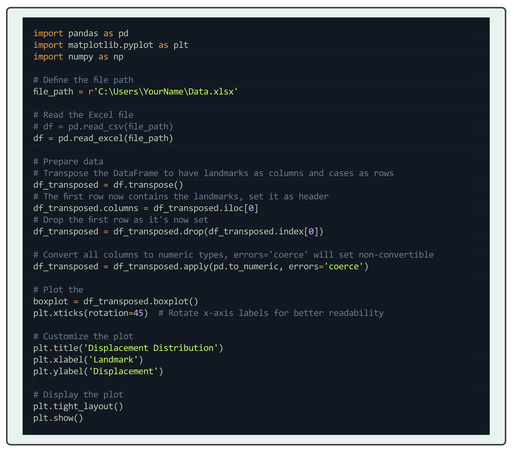

# Code Display

The `minted` package is a popular choice for code display in LaTeX. It uses the Python package `Pygments` to 
highlight code. To use `minted`, you need to have a Python distribution installed on your system. TeX Live will handle
additional installations that are required. If you are using MikTeX more information can be found on the
[Minted CTAN Page](https://ctan.org/pkg/minted?lang=en).

!!! Note
    From version 3 of `minted`, shell escape is no longer required.

!!! Note
    Minted supports a wide range of languages, including Python, C++, Java, and many more. For a full list of supported
    languages, please refer to the [Pygments documentation](https://pygments.org/docs/lexers/). Only Python will be 
    demonstrated here.

## Using minted on a code block

```latex
\documentclass{article}

\usepackage{minted}
\usepackage{xcolor}
\usepackage[margin={2.5cm,2.5cm}]{geometry}
\definecolor{code-bg}{RGB}{29, 35, 49}
\setminted{autogobble,breaklines,breakanywhere,python3}

\begin{document}
	\begin{minted}{python}
		import pandas as pd
		import matplotlib.pyplot as plt
		import numpy as np
		
		# Define the file path
		file_path = r'C:\Users\YourName\Data.xlsx'
		
		# Read the Excel file
		# df = pd.read_csv(file_path)
		df = pd.read_excel(file_path)
		
		# Prepare data for box plot
		# Transpose the DataFrame to have landmarks as columns and cases as rows
		df_transposed = df.transpose()
		# The first row now contains the landmarks, set it as header
		df_transposed.columns = df_transposed.iloc[0]
		# Drop the first row as it's now set as the header
		df_transposed = df_transposed.drop(df_transposed.index[0])
		
		# Convert all columns to numeric types, errors='coerce' will set non-convertible values to NaN
		df_transposed = df_transposed.apply(pd.to_numeric, errors='coerce')
		
		# Plot the box plot
		boxplot = df_transposed.boxplot()
		plt.xticks(rotation=45)  # Rotate x-axis labels for better readability
		
		# Customize the plot
		plt.title('Displacement Distribution')
		plt.xlabel('Landmark')
		plt.ylabel('Displacement')
		
		# Display the plot
		plt.tight_layout()
		plt.show()
	\end{minted}
\end{document}
```

Which would produce the following output:

```python
import pandas as pd
import matplotlib.pyplot as plt
import numpy as np

# Define the file path
file_path = r'C:\Users\YourName\Data.xlsx'

# Read the Excel file
# df = pd.read_csv(file_path)
df = pd.read_excel(file_path)

# Prepare data for box plot
# Transpose the DataFrame to have landmarks as columns and cases as rows
df_transposed = df.transpose()
# The first row now contains the landmarks, set it as header
df_transposed.columns = df_transposed.iloc[0]
# Drop the first row as it's now set as the header
df_transposed = df_transposed.drop(df_transposed.index[0])

# Convert all columns to numeric types, errors='coerce' will set non-convertible values to NaN
df_transposed = df_transposed.apply(pd.to_numeric, errors='coerce')

# Plot the box plot
boxplot = df_transposed.boxplot()
plt.xticks(rotation=45)  # Rotate x-axis labels for better readability

# Customize the plot
plt.title('Displacement Distribution')
plt.xlabel('Landmark')
plt.ylabel('Displacement')

# Display the plot
plt.tight_layout()
plt.show()
```

## Using minted on python file

```latex
\inputminted{python}{path/to/your/file.py}
```
Which would produce the same output as above.

## Inline code

To use `minted` for inline code, you can use the `\mintinline` command. For example:

```latex
\mintinline{python}{import pandas as pd}
```

## Customisation

There is a lot of customisation that can be done with `minted`. For more information, please refer to the 
[documentation](https://ctan.org/pkg/minted?lang=en)
and [Pygments style documentation](https://pygments.org/styles/).

## Using `minted` with `tcolorbox`

You can use `minted` with `tcolorbox` to create a box around your code. For example:

This requires the `tcolorbox` package to be installed and called.

```aiignore
\usepackage{tcolorbox}
\tcbuselibrary{minted}
```

Then you can use the following code:


```latex
\begin{tcblisting}{listing only, minted language=python}
import pandas as pd
import matplotlib.pyplot as plt
import numpy as np

# Define the file path
file_path = r'C:\Users\YourName\Data.xlsx'

# Read the Excel file
# df = pd.read_csv(file_path)
df = pd.read_excel(file_path)

# Prepare data
# Transpose the DataFrame to have landmarks as columns and cases as rows
df_transposed = df.transpose()
# The first row now contains the landmarks, set it as header
df_transposed.columns = df_transposed.iloc[0]
# Drop the first row as it's now set
df_transposed = df_transposed.drop(df_transposed.index[0])

# Convert all columns to numeric types, errors='coerce' will set non-convertible
df_transposed = df_transposed.apply(pd.to_numeric, errors='coerce')

# Plot the
boxplot = df_transposed.boxplot()
plt.xticks(rotation=45)  # Rotate x-axis labels for better readability

# Customize the plot
plt.title('Displacement Distribution')
plt.xlabel('Landmark')
plt.ylabel('Displacement')

# Display the plot
plt.tight_layout()
plt.show()
\end{tcblisting}
```

Which would produce the following output:

