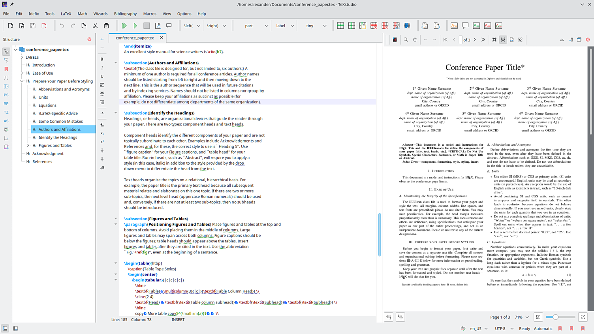
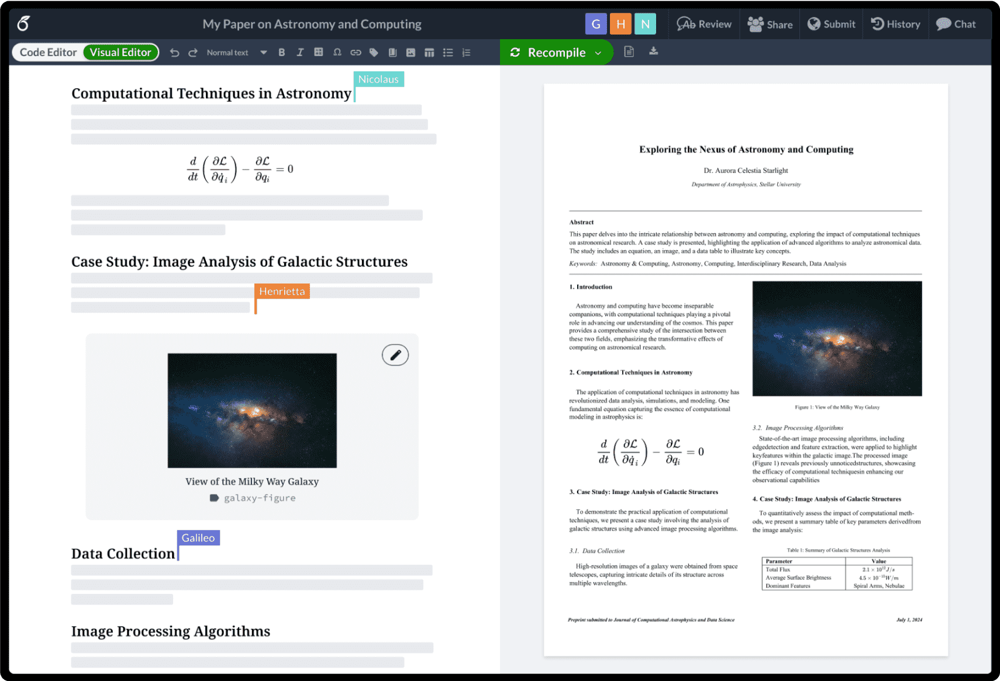
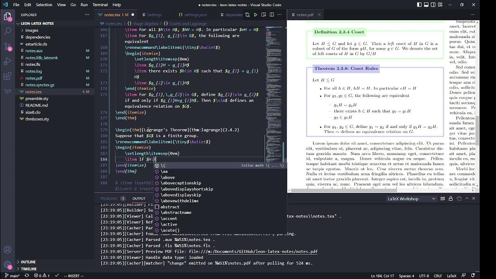
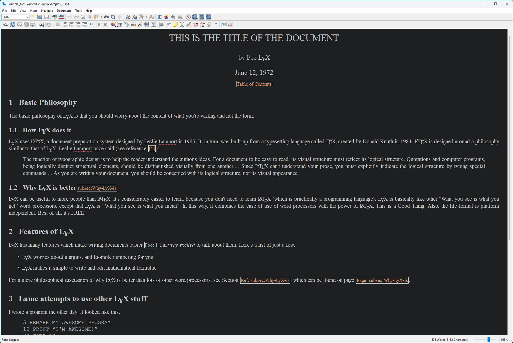
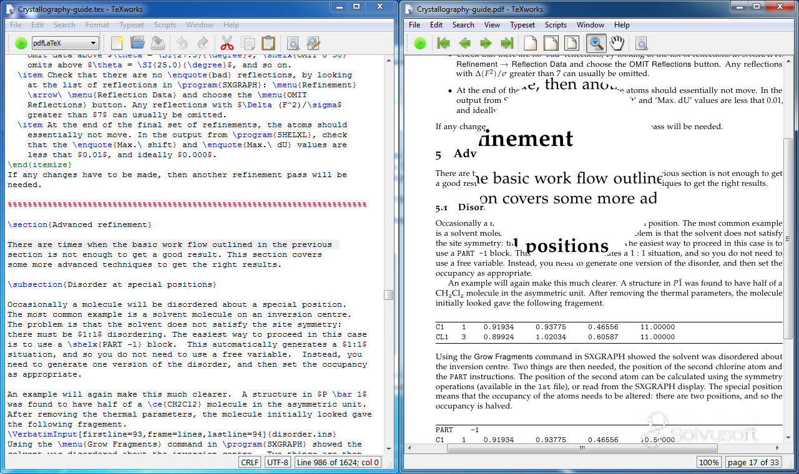
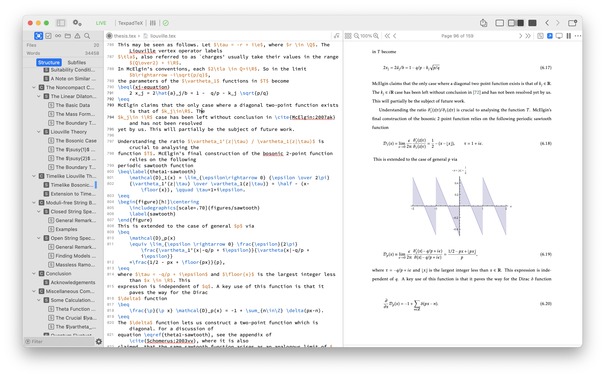

# Editors, IDEs, Interfaces, and Tools

!!! Note
    **_TLDR: [TeXstudio](https://www.texstudio.org/) or [Overleaf](https://www.overleaf.com/) are good choices for LaTeX editing._**

!!! Note
    TeXstudio is my personal preference for LaTeX editing.

For the purpose of this section all options will be referred to as editors. However, some of the options are 
full-fledged IDEs, interfaces, or tools.

There are multiple good editor choices available for LaTeX. The choice of editor is a personal preference and the ones
listed here are not exhaustive. The editors listed here are popular and have good support for LaTeX.

## [TeXstudio](https://www.texstudio.org/)

TeXstudio is a fully featured LaTeX editor. It is open source and cross-platform. It has a modern interface built on
top of the Qt framework. It has a built-in PDF viewer, syntax highlighting, code completion, and a lot of other features.
There is version control available through the use of git and svn although this is not as fully featured/user-friendly
as some other editors.

It additionally has a built-in viewer for inline preview of equations and images. It has a built-in spell checker and
supports multiple languages, as well as local custom package loading.

It is a good choice for beginners and advanced users alike offering a highly customizable approach to LaTeX editing. 
And simple engine and compiler configuration through the use of magic comments amongst others.

```latex
% !TeX program = lualatex
```



## [Overleaf](https://www.overleaf.com/)

Overleaf is a cloud-based LaTeX editor. It is a good choice for collaborative work and for those who do not want to
install LaTeX on their local machine. It has a modern interface and supports real-time collaboration (paid feature).

It has a built-in PDF viewer, syntax highlighting, code completion, and a lot of other features. It has a built-in spell
checker and supports multiple languages. It has a built-in version control system and supports multiple file formats.
Additionally, it has a built-in template system where thousands of user contributed templates are available. It has
limited support for custom packages and some special packages are not supported.

It is a good choice for beginners and advanced users alike offering guided and controlled approach to LaTeX editing.

However, it is a cloud-based editor and requires an internet connection to use. It has a free tier with limited features
and a paid tier with more features. It supports multiple compilers on all tiers, although, if you need a compiler other
than pdfLaTeX you will struggle to stay within the free tiers compile time for more complex documents.



## [Visual Studio Code](https://code.visualstudio.com/)

!!! info
    Visual Studio Code is not a LaTeX editor by default. It requires the 
    [LaTeX Workshop extension](https://marketplace.visualstudio.com/items?itemName=James-Yu.latex-workshop) 
    to be installed.

Visual Studio Code is a general-purpose code editor. It is open source and cross-platform. It has a modern interface
built on top of the Electron framework. It has a built-in PDF viewer, syntax highlighting, code completion, and a lot of
addons available through the marketplace.

It has LaTeX support through the LaTeX Workshop extension. Which allows VS Code to be a full-fledged LaTeX editor. It
has a built-in spell checker and supports multiple languages. It has a support for multiple compilers and engines
although the setup can be more complex than other editors. It supports multiple version control systems and has good git
support.



## [LyX](https://www.lyx.org/)

LyX is a document processor that is more WYSIWYG than other LaTeX editors essentially being as close to word as you can
get with LaTeX. It is open source and cross-platform. It has a modern interface built on top of the Qt framework.

It removes the need to write LaTeX code directly and instead allows you to write in a more word processor like manner.
Providing a very intuitive interface for beginners and advanced users alike.

Although it can be extremely powerful it can also be limiting in some cases where you may require more control, specific
packages, or want to use templates from the internet; It tries to handle everything for you and requires specific files
to include templates.

It abstracts the LaTeX code away from the user and can be a good choice for those who do not want to learn LaTeX but
still want to use it.



## [TeXWorks](https://www.tug.org/texworks/)

TeXWorks is a simple LaTeX editor. It is open source and cross-platform and is part of the TeX Live distribution. It has
a barebones interface and is good for those who want a simple editor without a lot of features. But lacks some of the
comforts of other editors such as code completion and spell checking.



## [TeXifier](https://www.texifier.com/)

TeXifier is a mac/ios specific LaTeX editor that provide real-time preview of the document. It is a good choice for 
those who want to remove the hassle of compiling the document to see the changes. It provides modern features like 
document trees, syntax highlighting, code completion, and todo lists.

It provides LaTeX package management built in and does not require the user to install LaTeX packages manually. However,
you are limited to the packages and versions that are available through the app.

Lack of user package management can be a limitation for some users. But it remains a good choice for those who want a
polished and fully-featured LaTeX editor with no compiling.

