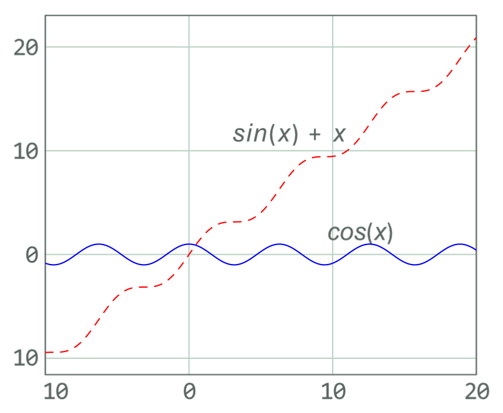

# Extending LaTeX

## Lua Code through LuaLaTeX

!!! Note
    I recommend not using the `luacode` package. Use the `directlua` command instead as shown below.

LuaLaTeX is a LaTeX engine that allows you to run Lua code in your LaTeX document. Lua is a powerful scripting language
that is easy to learn and use (somewhat similar to python). LuaLaTeX is included in most LaTeX distributions and does 
not require any additional installation.

To use LuaLaTeX, you need use LuaLaTeX instead of pdfLaTeX, enable it though a [magic comment](magic-coms.md). 
For example:

```latex
% !TeX program = lualatex
```

Then you can use Lua code in your LaTeX document. For example:

```latex
\documentclass{article}

\begin{document}
    \directlua{
        local x = 5
        local y = 10
        tex.print(x + y)
    }
\end{document}
```

This would print $15$ in the LaTeX document as if it were written in LaTeX.

LuaLaTeX can be used for a variety of tasks such as generating tables, plots, and other LaTeX code. As LuaLaTeX is
moving to be the standard LaTeX engine certain packages may require LuaLaTeX to work properly.

And example of using LuaLaTeX to generate a table is shown below:

```latex
\documentclass{article}

\begin{document}
	\directlua{
		tex.print("\\begin{tabular}{|c|c|c|}")
		tex.print("\\hline")
		tex.print("1 & 2 & 3 \\\\")
		tex.print("\\hline")
		tex.print("4 & 5 & 6 \\\\")
		tex.print("\\hline")
		tex.print("7 & 8 & 9 \\\\")
		tex.print("\\hline")
		tex.print("\\end{tabular}")
	}
\end{document}
```

This would print the following table in the LaTeX document as if it were written in LaTeX.

$$
\begin{array}{|c|c|c|}
    \hline
    1 & 2 & 3 \\
    \hline
    4 & 5 & 6 \\
    \hline 
    7 & 8 & 9 \\
    \hline
\end{array}
$$

LuaLaTeX can additionally be used for plotting through the luaplot package or using it to pass variables back. It uses
metapost to generate the plots.
See an example of using `luaplot` below:
    
```latex
\documentclass{article}

\usepackage{luaplot}

\begin{document}
	\luaplot[
	xmin=-10,
	xmax=20,
	plotpts=300,
	hor='6cm',
	ver='5cm',
	clr={'red; blue'},
	plotsty={'dashed evenly'},
	plotoptions={
		[[
		autogrid(grid.bot,grid.lft) withcolor .85white;
		glabel(btex ${sin(x)+x}$ etex,(7,11.5)) withcolor (0,1,0);
		glabel(btex ${cos(x)}$ etex,(12,2)) withcolor (0,1,0);
		]]
	}
	]
	{sin(x)+x,cos(x)}
\end{document}
```

Which produces the following plot:



### Basic Lua Stats

LuaLaTeX can be used to generate basic statistics. For example, the following code will generate the mean, median, mode,
and standard deviation of a list of numbers.

```latex
\documentclass{article}

\begin{document}

\directlua{
    function mean(t)
        local sum = 0
        for i = 1, #t do
            sum = sum + t[i]
        end
        return sum / #t
    end

    function median(t)
        table.sort(t)
        if #t % 2 == 0 then
            return (t[#t / 2] + t[#t / 2 + 1]) / 2
        else
            return t[math.ceil(#t / 2)]
        end
    end

    function mode(t)
        local counts = {}
        for i = 1, #t do
            if counts[t[i]] == nil then
                counts[t[i]] = 1
            else
                counts[t[i]] = counts[t[i]] + 1
            end
        end
        local max = 0
        local mode = nil
        for k, v in pairs(counts) do
            if v > max then
                max = v
                mode = k
            end
        end
        return mode
    end

    function std(t)
        local m = mean(t)
        local sum = 0
        for i = 1, #t do
            sum = sum + (t[i] - m)^2
        end
        return math.sqrt(sum / #t)
    end

    local t = {1, 2, 3, 4, 5, 6, 7, 8, 9, 10}
    tex.print("Mean: " .. mean(t) .. "\string\\par")
    tex.print("Median: " .. median(t) .. "\string\\par")
    tex.print("Mode: " .. mode(t) .. "\string\\par")
    tex.print("Standard Deviation: " .. std(t) .. "\string\\par")
}
\end{document}
```

Occasionally you may run in to issues with closing `}` in the lua code. Here it can be better to save the code as a
`*.lua` file and input it into the document. Or use the `luacode` package.

### Lua Math Calculations

As already shown in the basic stats example, Lua can be used to perform math calculations. However, it can be a bit of 
a hassle to code each function you may ever want to use in Lua. Instead, you can use the `luacas` package to make
math calculations easier. It comes with a variety of functions that can be used to perform math calculations.

For example, the following code will perform evaluation on an expression of an equation using the `luacas` package.

```latex
\documentclass{article}

\usepackage{luacas}

\begin{document}

	\begin{CAS}
		vars('x')
		y = diff(x^2+x,x)+diff(2*x,x)
		y = y:evaluate()
		y = y:autosimplify()
	\end{CAS}
	\[ y = \print{y} \]
	
	\begin{CAS}
		vars('x', 'y')
		z = diff(x^2+x*2*y^2,x)
		z = z:evaluate()
		z = z:autosimplify()
	\end{CAS}
	\[ z = \print{z} \]

\end{document}
```

This would print the following in the LaTeX document as if it were written in LaTeX.

$$
y = 3 + 2x
$$

$$
z = 2x + 2y^2
$$

You may still need to make your own functions for more complex calculations, that the `luacas` package does not cover.


## Python Code through PythonTeX

!!! Note
    PythonTeX does not require you to use -shell-escape.

PythonTeX requires a Python installation and the `pythontex` package. The package can be installed through the 
[package manager](installation.md) of your LaTeX distribution or manually from [CTAN](ctan.md). 

Once the package is installed you need to add the following to your build instructions for your document:

```aiignore
pythontex %.tex
```

So your build instructions might look like this:

```aiignore
pdflatex %.tex | pythontex %.tex | pdflatex %.tex | view-pdf %.pdf
```

or in TeXstudio would put the following in the user command:

name: `pythontex:pythontex`

command: 
```aiignore
pythontex %.tex
```

then you can run your build command as:

```aiignore
txs:///compile | txs:///pythontex | txs:///compile | txs:///view-pdf
```

Now you can use Python code in your LaTeX document. For example:

```latex
\documentclass{article}

\usepackage[gobble=auto]{pythontex}
\begin{document}
	\begin{pycode}
		import numpy as np
		x = np.linspace(0, 2*np.pi, 100)
		y = np.sin(x)
		print(f'y={y[1]} and x={x[43]}')
	\end{pycode}
\end{document}
```

!!! Note
    I recommend using the `gobble=auto` option in the `pythontex` package. This will handle your indentation for you.

This would print the value of `y` at index 1 and `x` at index 43.
in the LaTeX document as if it were written in LaTeX.

It would look like this in the output:

$$
y=0.0634239196565645 \text{ and } x=2.729060284936588
$$

There is generally no limit to the Python code you can run in your LaTeX document. You can even use PythonTeX to
generate tables, plots, and other LaTeX code. However, be aware that PythonTeX has not been updated in a while and
may have some stability issues.

PythonTeX can additionally be use for plotting like shown in [PGF Graphics in Python](python-graphics.md). However, you
still need to input the `pgf` file after the PythonTeX code.

For example:

```latex
\documentclass{article}

\usepackage[gobble=auto]{pythontex}

\begin{document}
    \begin{pycode}
        import matplotlib.pyplot as plt
        import numpy as np
        x = np.linspace(0, 2*np.pi, 100)
        y = np.sin(x)
        plt.plot(x, y)
        plt.savefig('plot.pgf')
    \end{pycode}
    \begin{figure}
        \centering
        \input{plot.pgf}
    \end{figure}
\end{document}
```

## Using Numerica for Math Calculations

Numerica is a package that allows you to perform math calculations in LaTeX. It offer a non LuaTeX alternative to
performing math calculations in LaTeX. It is not as powerful as PythonTeX but it is a good alternative.

Numerica is included in most LaTeX distributions and does not require any additional installation. To use Numerica, you
need to include the package in your LaTeX document. For example:

```latex
\usepackage{numerica}
```

Then you can use Numerica code in your LaTeX document. For example:

```latex
\documentclass{article}

\usepackage{amssymb}

\begin{document}
	\begin{align}
		x &= 5 \\
		y &= 10 \\
		z &= x^2 \times 4y \\
		\therefore z &= \eval*{x^2 * 4y}[x=5,y=10]
    \end{align}
\end{document}
```

This would print the value of $z$ in the LaTeX document as if it were written in LaTeX.

It would look like this in the output:

$$
\begin{align}
    x &= 5 \\
    y &= 10 \\
    z &= x^2 \times 4y \\
    \therefore z &= 1000
\end{align}
$$

Numerica will also work inline, for example:

```latex
\eval{$x^2 \times 4y$}[x=5,y=10] 
```

Displaying the following: $x^2 \times 4y = 1000$ $(x=5,y=10)$.

!!! Note
    You can use the `env=$` option instead to make the output inline. But can confuse your editor's syntax highlighting 
    until you start a new line. However, it should not cause any other issues.

For more information on Numerica and its full capabilities see the [documentation](https://ctan.org/pkg/numerica).
