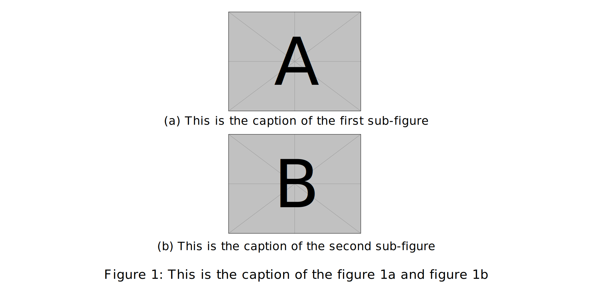
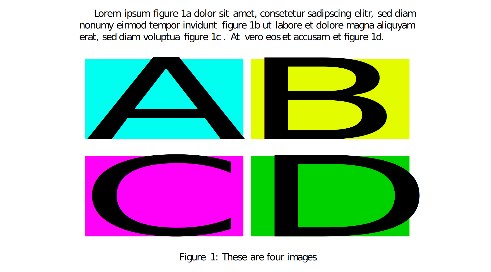

# Figures in LaTeX

Figures are generally easy to handle in LaTeX, a standard `figure` float will handle the majority of cases. 

!!! note
    Try to allow LaTeX to handle placement, it has an algorithm that will generally place the figure in the best place.
    If this is not working for you, you can use the [placement options](figures.md/#figure-placement) to force the figure to be placed in a specific

However, complexity can arise when you want to start adding sub-figures, 
or having figures side-by-side. This document will cover the basics of adding figures to your LaTeX document, as well 
as how to add sub-figures and have multiple figures side-by-side. Or maybe you have a single image file that has
multiple sub-figures in it, and you want them to be referenced separately.

## Basic Figure

!!! Note
    If you want to load an included image, you need to use the `graphicx` package. You can include this package in your
    document by adding the following line to your preamble:
    ```latex
    \usepackage{graphicx}
    ```

!!! Note
    The `graphicx` package does not support all image formats. The main format it supports are `.pdf`, `.eps`, `.png`, 
    and `.jpg`. It does not support `.svg` files.

### Graphicx Example

The basic figure is simple, you can use the following code to add an existing image in a figure environment 
to your document:

```latex
\begin{figure}[h]
    \centering
    \includegraphics[width=0.5\textwidth]{path/to/image}
    \caption{This is the caption of the figure}
    \zlabel{fig:figure1}
\end{figure}
```

This will add a figure to your document, with the image centered and the caption below the image. The `width` parameter
of the `includegraphics` command can be adjusted to change the size of the image. The `zlabel` command is used to 
reference the figure in the text.

The `\textwidth` command reads the size of the text field between the margins, so `0.5\textwidth` will make the image
half the width of the text field.


### TikZ and TeX Figures

When making figures in tikz or import a tex file sizing can be a bit more difficult. A solution to this is to use
`resizebox` which is provided by the `graphicx` package and can be extended with the `adjustbox` package if required. 
For example:

```latex
\begin{figure}[h]
    \centering
    \resizebox{0.5\textwidth}{!}{
        \begin{tikzpicture}
            \draw (0,0) -- (1,1);
        \end{tikzpicture}
    }
    \caption{This is the caption of the figure}
    \zlabel{fig:figure1}
\end{figure}
```

This will make the tikz picture half the width of the text field. The `!` in the `resizebox` command will keep the 
aspect ratio of the image. You can switch the `!` with the width field to make the image a sized based on height.

#### TikZ Example

If you wanted to include a tikz picture you would place your tikz code inside the `figure` environment. For example:

```latex
\begin{figure}[h]
    \centering
    \begin{tikzpicture}
        \draw (0,0) -- (1,1);
    \end{tikzpicture}
    \caption{This is the caption of the figure}
    \zlabel{fig:figure1}
\end{figure}
```

#### TeX Example

And if you wanted to input a `tex` file you would use the `input` command. For example if you had written your tikz
figure in a separate file:

```latex
\begin{figure}[h]
    \centering
    \input{path/to/tex/file}
    \caption{This is the caption of the figure}
    \zlabel{fig:figure1}
\end{figure}
```

## Sub-Figures

!!! Note
    `subcaption` is the recommended modern package for handling sub-figures. The older `subfigure` package is 
    deprecated. And the `subfig` package is unsupported, but will still work for most cases.

If you want to add multiple figures in a single figure environment, you can use the `subcaption` package. This package
allows you to add multiple sub-figures in a single figure environment.

### Subcaption Example

To add sub-figures to your document, you can use the following code:

```latex
\usepackage{zref-clever}
\usepackage{subcaption}
\usepackage{mwe} % Provides example images


\begin{document}
	\begin{figure}[h]
		\centering
		\begin{subcaptiongroup}
			\includegraphics[width=0.3\textwidth]{example-image-a}
			\caption{This is the caption of the first sub-figure}
			\zlabel{fig:subfigure1}
			\includegraphics[width=0.3\textwidth]{example-image-b}
			\caption{This is the caption of the second sub-figure}
			\zlabel{fig:subfigure2}
		\end{subcaptiongroup}
		\captionsetup{subrefformat=parens}
		\caption{This is the caption of the \zcref{fig:subfigure1} and \zcref{fig:subfigure2}}
		\zlabel{fig:figure2}
	\end{figure}
\end{document}
```

This would look like the following:



In this example they are seperate images that are being included, but you can also include a single image that has
multiple sub-figures in it. This is useful if you have a single image file that has multiple sub-figures in it, and you
want them to be referenced separately.

#### Single Image with Sub-Figures Example

```latex
\usepackage{graphicx}
\usepackage{subcaption}
\usepackage{zref-clever}
\usepackage{hyperref}
\usepackage{mwe} % Provides example images

\newsavebox{\fourfigurebox}

\begin{document}
	
	Lorem ipsum \zcref{subfig:a}  dolor sit amet, consetetur sadipscing elitr, sed diam nonumy eirmod tempor invidunt 
	\zcref{subfig:b} ut labore et dolore magna aliquyam erat, sed diam voluptua \zcref{subfig:c}. 
	At vero eos et accusam et \zcref{subfig:d}.
	
	\begin{figure}[htp]
		\sbox\fourfigurebox{\includegraphics[width=\textwidth]{foursquare.pdf}}% change with your own image
		
		\begin{subfigure}[t][0.5\ht\fourfigurebox]{0.5\textwidth}
			\refstepcounter{subfigure}\zlabel{subfig:a}
		\end{subfigure}%<---- Don't forget
		\begin{subfigure}[t][0.5\ht\fourfigurebox]{0.5\textwidth}
			\refstepcounter{subfigure}\zlabel{subfig:b}
		\end{subfigure}\par\nointerlineskip
		\begin{subfigure}[t][0.5\ht\fourfigurebox]{0.5\textwidth}
			\refstepcounter{subfigure}\zlabel{subfig:c}
		\end{subfigure}%<---- Don't forget
		\begin{subfigure}[t][0.5\ht\fourfigurebox]{0.5\textwidth}
			\refstepcounter{subfigure}\zlabel{subfig:d}
		\end{subfigure}\par\nointerlineskip
		\smash{\usebox{\fourfigurebox}}
		
		\caption{These are four images}\zlabel{fig:four}
		
	\end{figure}
	
\end{document}
```

This would look like the following:



## Figure Placement

LaTeX has a built-in algorithm for placing figures, but sometimes you may want to force the figure to be placed in a
specific location. You can do this by using the placement options in the `figure` environment.

| Placement Option |                        Description                        |
|:----------------:|:---------------------------------------------------------:|
|       `h`        |            Place the figure here (if possible)            |
|       `t`        |          Place the figure at the top of the page          |
|       `b`        |        Place the figure at the bottom of the page         |
|       `p`        |            Place the figure on a separate page            |
|       `!`        |      Override the internal LaTeX placement algorithm      |
|       `h!`       |    Place the figure here (even if it is not possible)     |
|       `ht`       |      Place the figure here or at the top of the page      |
|       `hb`       |    Place the figure here or at the bottom of the page     |
|      `htb`       | Place the figure here or at the top or bottom of the page |

LaTeX will try to place figure floats close to where they are defined or referenced in the text. If that placement is
not possible LaTeX will try and place the float in the next available location that satisfies its placement rules.

You should leave placement to LaTeX as much as possible; especially if you have not finished writing your document. 
Once you have finished writing your document, you can then go back and adjust the placement of the figures if needed.