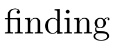

# Fonts

Fonts are a key element of any written document and so you want to make sure you are utilising them effectively.

LaTeX supports a wide range of fonts and has a number built in and designed specifically for it. However, you can also 
use any font that is installed on your system.

The main distinction is between TrueType (TTF), OpenType (OTF) and Type-1 fonts. TrueType and OpenType are the most 
common and are supported by most modern systems. Type 1 fonts are an older format and are less common.

Type-1 fonts were developed in the 1980s by Adobe and are still widely used in the publishing industry. Around the same
time TrueType fonts were developed in the 1980s by Apple and then OpenType fonts were developed due to a failed attempt
to license Apples typography technology in the 1990s developed by Microsoft and Adobe. 
OpenType fonts are the most modern and are the most feature rich.

The main difference between TrueType and OpenType fonts is that OpenType fonts are able to contain more glyphs and
support more languages. They also have more advanced typographic features such as ligatures, small caps and old style
figures.

Type-1 fonts are the default in LaTeX and are still widely used. However, you can use TrueType and OpenType fonts in
LaTeX.

One of the greatest advantages of LaTeX is its management of typography compared to other document preparation systems.
This is due to the fact that LaTeX is a typesetting system and not a word processor. This means that LaTeX is able to
produce high quality typography that is consistent and professional.

For example the handling of ligatures, kerning and hyphenation is much better in LaTeX than in other systems.

<figure markdown="span">
    {: style="width:200px"}
    <figcaption>Default Ligatures in LaTeX _(Computer Modern)_</figcaption>
</figure>

<figure markdown="span">
    {: style="width:200px"}
    <figcaption>Default ligatures in Word _(Times New Roman)_</figcaption>
</figure>

The default font in LaTeX is Computer Modern. This is a serif font and is designed to be easy to read. However, you may
want to use a different font for your document. This can be done by using the `fontspec` package.

The `fontspec` package allows you to use TrueType and OpenType fonts in LaTeX. It also allows you to set the font size,
font weight and font style. However, you must use a compiler that supports the `fontspec` package such as `XeLaTeX` or
`LuaLaTeX`.

You need to be careful when using non-standard LaTeX fonts as they may not support all the features you require. In
these cases you may need to find additionally packages to provide the features you need. This may include a different
font for math mode or a different font for sans-serif text.

To set the font for your document you need to load the package for the font, for example to use `Helvetica` the 
`\usepackage{helvet}` command should be used. You can then set the font using the 
`\renewcommand{\familydefault}{\sfdefault}` command.

The following is an example of how to set the font to `Helvetica`:

```latex
\documentclass{article}
\usepackage{helvet}
\renewcommand{\familydefault}{\sfdefault}
\begin{document}
This is some text in Helvetica.
\end{document}
```

If you need to set your font a specific family (between `roman`, `sans` and `monospace`), you can use the following
commands:

```latex
\renewcommand{\familydefault}{\rmdefault} % Roman
\renewcommand{\familydefault}{\sfdefault} % Sans-serif
\renewcommand{\familydefault}{\ttdefault} % Monospace
```

This is specific to using LaTeX type fonts in `pdflatex`. If you are using `XeLaTeX` or `LuaLaTeX` you can use the
`fontspec` package to set the font. For example to set the font to `Helvetica` you would use the following commands:

```latex
\documentclass{article}
\usepackage{fontspec}
\setmainfont{Helvetica}
\begin{document}
This is some text in Helvetica.
\end{document}
```

This will set the main font for the document to `Helvetica`. You can also set the font size, weight and style using the
`fontspec` package.

You can see it's a bit simpler to control fonts in the `XeLaTeX` and `LuaLaTeX` engines. However, you can still use
`pdflatex` to use TrueType and OpenType fonts.

## Font Sizes

Font sizes in LaTeX are defined using a scale of sizes. The default font size is `10pt`. The available font sizes are:

- `10pt`
- `11pt`
- `12pt`

To control the font size you add an option in the `\documentclass` command. For example to set the font size to `12pt`
you would use the following command:

```latex
\documentclass[12pt]{article}
```

If you want to use additional font sizes you need to make sure you are using a scalable font. You can then use the
`extsizes` package or its specific classes like `extarticle` or `extreport` to use additional font sizes as a base.
Although this is generally not recommended.

If you want to use the standard `Computer Modern` font you can use the `fix-cm` package to allow for better scaling.

If you want to change text size within the document you can use either the predefined size name commands or the
fontsize command. For example:

```latex
\documentclass{article}

\begin{document}

{\tiny This is tiny text.} % Equivalent to \fontsize{5}{6}\selectfont or 5pt font.

{\scriptsize This is scriptsize text.} % Equivalent to \fontsize{7}{8}\selectfont or 7pt font.

{\footnotesize This is footnotesize text.} % Equivalent to \fontsize{8}{10}\selectfont or 8pt font.

{\small This is small text.} % Equivalent to \fontsize{9}{11}\selectfont or 9pt font.

{\normalsize This is normalsize text.} % Equivalent to \fontsize{10}{12}\selectfont or 10pt font.

{\large This is large text.} % Equivalent to \fontsize{12}{14}\selectfont or 12pt font.

{\Large This is Large text.} % Equivalent to \fontsize{14.4}{17.28}\selectfont or 14.4pt font.

{\LARGE This is LARGE text.} % Equivalent to \fontsize{17.28}{20.74}\selectfont or 17.28pt font.

{\huge This is huge text.} % Equivalent to \fontsize{20.74}{24.88}\selectfont or 20.74pt font.

{\Huge This is Huge text.} % Equivalent to \fontsize{24.88}{29.86}\selectfont or 24.88pt font.

{\fontsize{12}{14}\selectfont This is 12pt text.} % 12pt font with 14pt line spacing.

{\fontsize{20}{24}\selectfont This is 20pt text.} % 20pt font with 24pt line spacing.

Then some normal text. % Back to normal size 10pt font.

\end{document}
```

Where `\fontsize{size}{skip}` is the command to set the font size and the skip is the space between the lines.

## Font Size Table

The following table shows the available font sizes in LaTeX:

|     Command     |  Size   | Line Spacing |
|:---------------:|:-------:|:------------:|
|     `\tiny`     |   5pt   |     6pt      |
|  `\scriptsize`  |   7pt   |     8pt      |
| `\footnotesize` |   8pt   |     10pt     |
|    `\small`     |   9pt   |     11pt     |
|  `\normalsize`  |  10pt   |     12pt     |
|    `\large`     |  12pt   |     14pt     |
|    `\Large`     | 14.4pt  |   17.28pt    |
|    `\LARGE`     | 17.28pt |   20.74pt    |
|     `\huge`     | 20.74pt |   24.88pt    |
|     `\Huge`     | 24.88pt |   29.86pt    |


## Math Fonts

Math fonts are a key part of any document that contains mathematical equations. LaTeX has a number of built in 
math fonts that are designed to be easy to read and to work well with the text fonts. However, you may want to use a
different math font in your document.

The main math fonts in LaTeX are:

- `Computer Modern` - The default math font in LaTeX.
- `AMS` - The math font used by the American Mathematical Society.
- `STIX` - A comprehensive math font that is designed to be compatible with Times New Roman.

As with standard fonts, you are limited in your font choice by the engine you are using. If you are using `pdflatex` 
you are limited to Type 1 fonts. If you are using `XeLaTeX` or `LuaLaTeX` you can use TrueType and OpenType fonts.

By default, you will be using `Computer Modern`. To change the math font in your document you need to load the package 
for the font. 
For example to use the `STIX2` math font you would use the `\usepackage{stix2}` command. 
However, this would also override the text font. 
To only override the math font you can use the following option in the package command: `\usepackage[notext]{stix2}`.

The following is an example of how to set the math font to `STIX2`:

```latex
\documentclass{article}

\usepackage[notext]{stix2}

\begin{document}
This is some text in Computer Modern.
\[ x^2 + y^2 = z^2 \]
\end{document}
```

This will set the math font to `STIX2` while keeping the text font as `Computer Modern`.

Some packages will not have the same nice options in package loading and so you may need to load them differently, and 
this will be detailed in the package documentation.

For example if you wanted to set math font to `Cambria Math` you would use the following commands:

```latex
% !TeX TS-program = lualatex
\documentclass{article}

\usepackage{unicode-math}
\setmathfont{Cambria Math}

\begin{document}
This is some text in Computer Modern.
\[ x^2 + y^2 = z^2 \]
\end{document}
```


