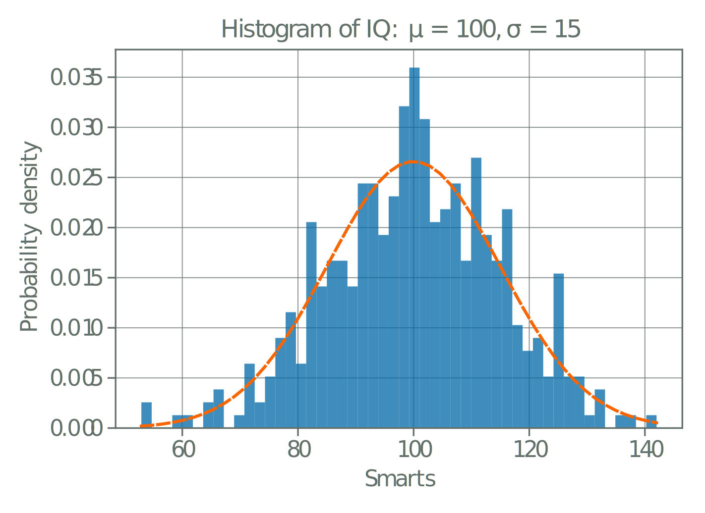
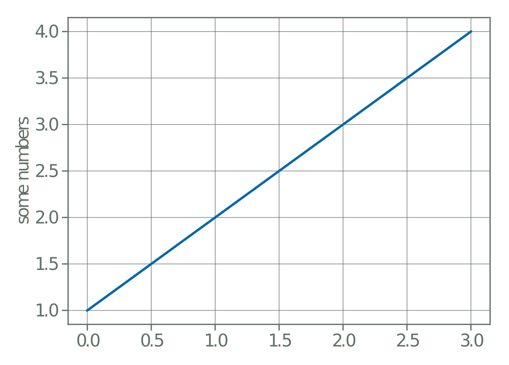
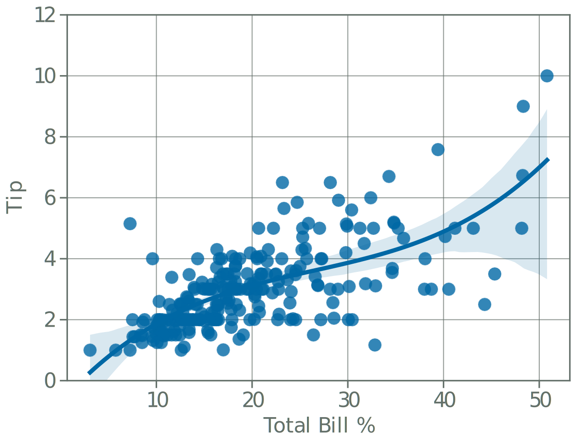

# PGF Graphics using Python

While PGFPlots is a generally powerful tool for plotting, it has limitations specifically when it comes to statistical
graphics. For example polynomial regression is not natively supported as of version 1.18. This is where Python can be
useful, as it has a wide range of libraries for creating complex statistical graphics.

Additionally, if you already use Python for data analysis, it may be more convenient to continue using Python rather
than learning the syntax for PGFPlots.

Using MatPlotlib, you can create your graphics in Python and then import them in to LaTeX using the `pgf` backend in 
MatPlotlib. This will allow you to create complex graphics in Python and then use them in your LaTeX document.

Using this method will often require the following LaTeX preamble:

```latex
\usepackage{tikz}
\usepackage{tikz-cd}
\usepackage{pgfplots}
\pgfplotsset{compat=1.18}
```

To do this, you will need to install the `matplotlib` package in Python. You can do this using `pip`:

```bash
pip install matplotlib
```

Then you can create your graphics in Python using MatPlotlib and save them as a `pgf` file. The important part is to set
the `matplotlib` backend to `pgf` and then save the figure as a `pgf` file. Bear in mind that this means you cannot use
`plt.show()` to display the plot, as this will not work with the `pgf` backend.

Additionally, you will need to set you `rcParams` in advance to ensure the plot renders how you want in LaTeX.

Figure sizes are specified in inches, and the default LaTeX `\textwidth` is 4.7747 inches. If you have set custom
margins in your LaTeX document, you will need to adjust the figure size accordingly.

## MatPlotlib Plots

```python
import matplotlib
import numpy as np
import matplotlib.pyplot as plt

matplotlib.use("pgf")
matplotlib.rcParams.update({
    "pgf.texsystem": "pdflatex",       # pdflatex, XeLaTeX, or LuaLaTeX for processing
    'font.family': 'serif', # use serif/main font for text elements
    'font.size' : 11,  # use 11 point font 
    'text.usetex': True,   # use LaTeX to write all text 
    'pgf.rcfonts': False, # Do not set up fonts from rc parameters
    "figure.figsize": [4.7747,3.5], # figure size in inches this is equivalent to the default LaTeX \textwidth
    'axes.edgecolor': 'gray',   # Axis line color
    'xtick.color': 'gray',      # Color of the tick labels
    'ytick.color': 'gray',       # Color of the tick labels
    'text.color': 'gray',        # Color of the text
    'axes.labelcolor': 'gray',   # Color of the x and y labels
    'grid.color': 'gray',         # Grid line color
    'grid.linestyle': '-',       # Grid line style
    'grid.linewidth': 0.5,        # Grid line width
    'axes.grid': True,            # Enable grid by default
    'grid.alpha': 0.7,            # Transparency of grid
    'axes.axisbelow': True      # Show grid below all plots
})

np.random.seed(19680801)

# example data
mu = 100  # mean of distribution
sigma = 15  # standard deviation of distribution
x = mu + sigma * np.random.randn(437)

num_bins = 50

fig, ax = plt.subplots()

# the histogram of the data
n, bins, patches = ax.hist(x, num_bins, density=1, alpha=0.75)

# add a 'best fit' line
y = ((1 / (np.sqrt(2 * np.pi) * sigma)) *
     np.exp(-0.5 * (1 / sigma * (bins - mu))**2))
ax.plot(bins, y, '--')
ax.set_xlabel('Smarts')
ax.set_ylabel('Probability density')
ax.set_title(r'Histogram of IQ: $\mu=100$, $\sigma=15$')

# Tweak spacing to prevent clipping of ylabel
fig.tight_layout()
plt.savefig('hist.pgf')
```

Then you can import the `pgf` file in to your LaTeX document using the `\input` command:

```latex
\begin{figure}
    \begin{center}
        \input{hist.pgf}
    \end{center}
\end{figure}
```

This produced the following output:

[](images/pyhist.svg)

Another plot can be created using the following code:

```python
import matplotlib
import numpy as np
import matplotlib.pyplot as plt

matplotlib.use("pgf")
matplotlib.rcParams.update({
    "pgf.texsystem": "pdflatex",       # pdflatex, XeLaTeX, or LuaLaTeX for processing
    'font.family': 'serif', # use serif/main font for text elements
    'font.size' : 11,  # use 11 point font 
    'text.usetex': True,   # use LaTeX to write all text 
    'pgf.rcfonts': False, # Do not set up fonts from rc parameters
    "figure.figsize": [4.7747,3.5], # figure size in inches
    'axes.edgecolor': 'gray',   # Axis line color
    'xtick.color': 'gray',      # Color of the tick labels
    'ytick.color': 'gray',       # Color of the tick labels
    'text.color': 'gray',        # Color of the text
    'axes.labelcolor': 'gray',   # Color of the x and y labels
    'grid.color': 'gray',         # Grid line color
    'grid.linestyle': '-',       # Grid line style
    'grid.linewidth': 0.5,        # Grid line width
    'axes.grid': True,            # Enable grid by default
    'grid.alpha': 0.7,            # Transparency of grid
    'axes.axisbelow': True      # Show grid below all plots
})

plt.plot([1, 2, 3, 4])
plt.ylabel('some numbers')
plt.savefig('test.pgf')
```

And then imported in to LaTeX:

```latex
\begin{figure}
    \begin{center}
        \input{test.pgf}
    \end{center}
\end{figure}
```

This produced the following output:

[](images/pyplot.svg)

This is a powerful way to create complex graphics in LaTeX, as it allows you to use the full power of MatPlotlib to
create your graphics. This is not just limited to MatPlotlib, you can use any Python package that uses MatPlotlib as a
backend to create your graphics, such as Seaborn or Plotly. This can be particularly useful if you are trying to import
statistical graphics in to your LaTeX document.

## Seaborn Plots

Seaborn is a Python data visualization library based on MatPlotlib. It provides a high-level interface for drawing
attractive and informative statistical graphics. You can use Seaborn to create complex statistical graphics and then
import them in to LaTeX using the `pgf` backend in MatPlotlib.

To use Seaborn, you will need to install the `seaborn` package in Python. You can do this using `pip`:

```bash
pip install seaborn
```

Example seaborn plot:

```python
import matplotlib
import numpy as np
import matplotlib.pyplot as plt
import seaborn as sns

matplotlib.use("pgf")
matplotlib.rcParams.update({
    "pgf.texsystem": "pdflatex",       # pdflatex, XeLaTeX, or LuaLaTeX for processing
    'font.family': 'serif', # use serif/main font for text elements
    'font.size' : 11,  # use 11 point font 
    'text.usetex': True,   # use LaTeX to write all text 
    'pgf.rcfonts': False, # Do not set up fonts from rc parameters
    'axes.formatter.use_mathtext': True,  # Use mathtext for axes
    "figure.figsize": [4.7747,3.5], # figure size in inches
    'axes.edgecolor': 'gray',   # Axis line color
    'xtick.color': 'gray',      # Color of the tick labels
    'ytick.color': 'gray',       # Color of the tick labels
    'text.color': 'gray',        # Color of the text
    'axes.labelcolor': 'gray',   # Color of the x and y labels
    'grid.color': 'gray',         # Grid line color
    'grid.linestyle': '-',       # Grid line style
    'grid.linewidth': 0.5,        # Grid line width
    'axes.grid': True,            # Enable grid by default
    'grid.alpha': 0.7,            # Transparency of grid
    'axes.axisbelow': True,     # Show grid below all plots
})


# Load the example tips dataset
tips = sns.load_dataset("tips")

# Create a polynomial regression plot
sns.regplot(x="total_bill", y="tip", data=tips, order=3)
plt.ylim(0, 12)
plt.ylabel('Tip')
plt.xlabel('Total Bill $\%$')
plt.savefig('quadplot.pgf')
```

And then imported in to LaTeX:

```latex
\begin{figure}
    \begin{center}
        \input{quadplot.pgf}
    \end{center}
\end{figure}
```

This produced the following output:

[](images/pyquadplot.svg)

