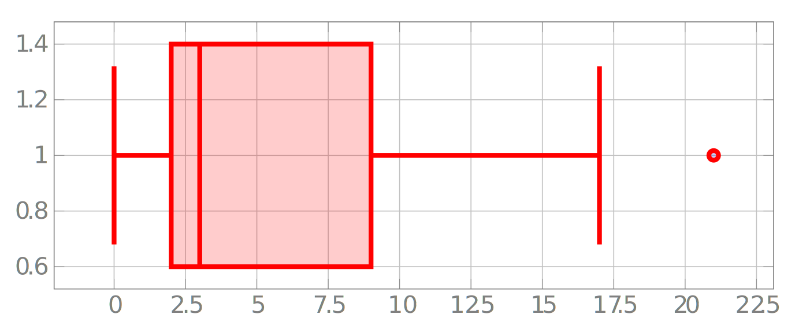
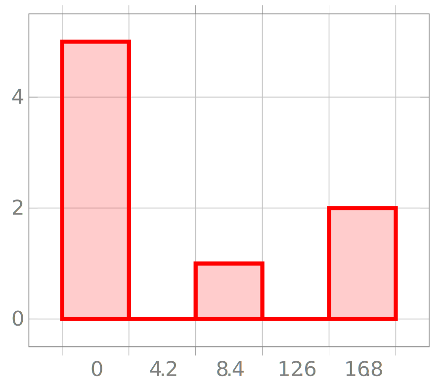
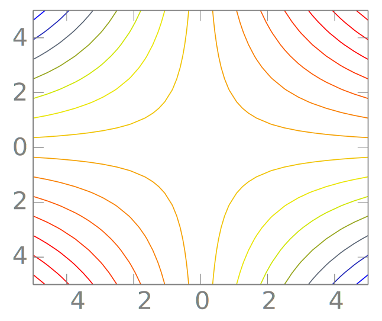

# Using TikZ/PGF to Create LaTeX Graphics

!!! Info
    This guide uses tikzjax to render TikZ/PGF code in the browser. If you cannot see the graphics, try refreshing the 
    page. If that does not work you may need to enable JavaScript or view the page in a browser that supports JavaScript.

TikZ and PGF can produce highly complex code and graphics, but in doing so, they require more time and effort to
learn and use effectively. This guide will provide a brief overview of how to use TikZ/PGF and PGFPlots to create 
graphics in LaTeX documents. However, I would strongly recommend reading the following resources for a fantastic guide 
on how to use them that will be far more comprehensive than this guide:

- [Unlocking LaTeX Graphics](https://latex-graphics.com/) - Dr Tamara G. Kolda
- [TikZ & PGF Manual](https://ctan.org/pkg/pgf)
- [PGFPlots Online Manual](https://tikz.dev/pgfplots/) - Unofficial HTML manual but very helpful
- [PGFPlots Manual](https://ctan.org/pkg/pgfplots)

Like in Kolda's guide this page will focus on the most used features of TikZ and PGF and most relevant elements
to producing graphics in a report, it will not cover every aspect of TikZ and PGF.

There can be some confusion around TikZ and PGF and how they relate to each other. TikZ is a frontend for PGF, which is
a lower-level language for producing graphics in LaTeX. TikZ is a more user-friendly interface for PGF, and it is what
most people use when creating graphics in LaTeX. However, PGF is more powerful and can be used to create more complex
graphics than TikZ. For the purposes of this guide, we will be using TikZ, but it is worth noting that PGF is also
available if you need more power. 

There is also PGFPlots which is a package built on top of TikZ and PGF that is specifically designed for creating 
plots and charts. It features plot types that are not natively available in TikZ/PGF, such as box plots. It is
maintained by the same team that maintains TikZ and PGF, so it is well-integrated with the rest of the LaTeX ecosystem.

Additionally, while these use to be separate packages, they are now bundled together in the same package, so you only
need to include `\usepackage{tikz}` in your preamble. But libraries can be loaded with either 
`\usetikzlibrary{<library>}` or `\usepgflibrary{<library>}`.

If you want to use PGFPlots, you will need to include `\usepackage{pgfplots}` in your preamble.

The following will show you how to create graphics using the `datavisulization` tool and `PGFPlots`.

### Getting Data in to TikZ

There are a few ways to get data in to TikZ, the most common are:

- Hardcoding the data in the TikZ code
- Using a CSV file
- Using a data file

The most common method is to hardcode the data in the TikZ code, but this can be cumbersome for large datasets. Using a
CSV file is a good alternative, as it allows you to keep the data separate from the code. This can be done using:

To read from a file:

```latex
\pgfdata[format=table, read from file=<filename.csv>]
```

```latex
\datavisualization [
    scientific axes=clean,
    x axis={length=3cm, ticks=few},
    all axes={grid},
    visualize as smooth line
    ] 
    data [format=table, read from file=file1.csv];
```

<script type="text/tikz">
\usetikzlibrary{datavisualization}
\begin{document}
\begin{tikzpicture}
\datavisualization [
    scientific axes={clean, width=\textwidth, height=5.5cm},
    x axis={ticks=few},
    y axis={max value=250, min value=-20},
    all axes={grid},
    visualize as smooth line/.list={explt},
    text=gray,
    visualizer color=red!90,
    explt={style={red,line width=2pt}}
    ] 
    data [set=explt] {
        x, y
        0, 0
        1, 3
        2, 9
        3, 17
        4, 90
        5, 21
        6, 2
        7, 229
        8, 3
        9, 81
        10, 2
    };
\end{tikzpicture}
\end{document}
</script>

Alternatively you can use `pgfplotstable` and `pgfplots` packages to read in data from a file, you will need to 
specify the column separator:

```latex
\usepackage{pgfplots}
\usepackage{pgfplotstable}

\begin{document}

\pgfplotstableread[col sep=comma]{<filename.csv>}\data

\begin{tikzpicture}
\begin{axis}[grid=both]
\addplot[smooth] table {\data};
\end{axis}
\end{tikzpicture}

\end{document}
```

<script type="text/tikz">
\usepackage{pgfplots}
\pgfplotsset{width=\textwidth, height=7.5cm}
\begin{document}
\begin{tikzpicture}
\begin{axis}[grid=both, axis line style=gray, text=gray, xmin=0, xmax=10, xtick distance=2.5]
\addplot [smooth, color=red!90, line width=2pt] coordinates {
        (0, 0)
        (1, 3)
        (2, 9)
        (3, 17)
        (4, 90)
        (5, 21)
        (6, 2)
        (7, 229)
        (8, 3)
        (9, 81)
        (10, 2)
    };
\end{axis}
\end{tikzpicture}
\end{document}
</script>

As you will notice this is a lot more verbose than the datavisualization method. Datavisualization is designed to be
simpler and is more user-friendly for most basic plots. However, `pgfplots` is a very powerful package and is 
widely used and has a wealth of documentation due to its age while data visualization is still relatively new in 
the scheme of LaTeX packages.

!!! Note
    PGFPlots has not been updated since 2021. While PGF (which contains Datavisualization) is still actively
    updated. This is not to say that PGFPlots is not a good package, it is still widely use and can plot things that
    Datavisualization cannot. But it is worth noting that Datavisualization is the newer package and is more 
    user-friendly when a simpler plot is needed.

!!! Note
    The following sections will include examples of both `pgfplots` and `datavisualization` to show the differences
    between the two packages, where applicable.
    Some plots may not be available in `datavisualization` and will be shown using `pgfplots` only.

### Scatter Plots

#### Datavisualization

```latex
\usetikzlibrary{datavisualization}
\begin{document}
\begin{tikzpicture}
\datavisualization [
    scientific axes={clean, width=.55\textwidth, height=5.5cm},
    x axis={ticks=few},
    y axis={max value=250, min value=-20},
    all axes={grid},
    visualize as scatter/.list={explt},
    text=gray,
    visualizer color=red!90,
    explt={style={red,line width=2pt}}
    ] 
    data [set=explt] {
        x, y
        0, 0
        1, 3
        2, 9
        3, 17
        4, 90
        5, 21
        6, 2
        7, 229
        8, 3
        9, 81
        10, 2
    };
\end{tikzpicture}
\end{document}
```

<script type="text/tikz">
\usetikzlibrary{datavisualization}
\begin{document}
\begin{tikzpicture}
\datavisualization [
    scientific axes={clean, width=\textwidth, height=5.5cm},
    x axis={ticks=few},
    y axis={max value=250, min value=-20},
    all axes={grid},
    visualize as scatter/.list={explt},
    text=gray,
    visualizer color=red!90,
    explt={style={red,line width=2pt}}
    ] 
    data [set=explt] {
        x, y
        0, 0
        1, 3
        2, 9
        3, 17
        4, 90
        5, 21
        6, 2
        7, 229
        8, 3
        9, 81
        10, 2
    };
\end{tikzpicture}
\end{document}
</script>

#### PGFPlots

```latex
\usepackage{pgfplots}
\begin{document}
\begin{tikzpicture}
\begin{axis}[grid=both, axis line style=gray, text=gray, xmin=0, xmax=10, xtick distance=2.5]
\addplot [only marks, color=red!90, line width=2pt] coordinates {
        (0, 0)
        (1, 3)
        (2, 9)
        (3, 17)
        (4, 90)
        (5, 21)
        (6, 2)
        (7, 229)
        (8, 3)
        (9, 81)
        (10, 2)
    };
\end{axis}
\end{tikzpicture}
\end{document}
```

<script type="text/tikz">
\usepackage{pgfplots}
\pgfplotsset{width=\textwidth, height=7.5cm}
\begin{document}
\begin{tikzpicture}
\begin{axis}[grid=both, axis line style=gray, text=gray, xmin=0, xmax=10, xtick distance=2.5]
\addplot [only marks, color=red!90, line width=2pt] coordinates {
        (0, 0)
        (1, 3)
        (2, 9)
        (3, 17)
        (4, 90)
        (5, 21)
        (6, 2)
        (7, 229)
        (8, 3)
        (9, 81)
        (10, 2)
    };
\end{axis}
\end{tikzpicture}
\end{document}
</script>


### Line Plots

#### Datavisualization

```latex
\usetikzlibrary{datavisualization}
\begin{document}
\begin{tikzpicture}
\datavisualization [
    scientific axes={clean, width=.55\textwidth, height=5.5cm},
    x axis={ticks=few},
    y axis={max value=250, min value=-20},
    all axes={grid},
    visualize as smooth line/.list={explt},
    text=gray,
    visualizer color=red!90,
    explt={style={red,line width=2pt}}
    ] 
    data [set=explt] {
        x, y
        0, 0
        1, 3
        2, 9
        3, 17
        4, 90
        5, 21
        6, 2
        7, 229
        8, 3
        9, 81
        10, 2
    };
\end{tikzpicture}
\end{document}
```

<script type="text/tikz">
\usetikzlibrary{datavisualization}
\begin{document}
\begin{tikzpicture}
\datavisualization [
    scientific axes={clean, width=\textwidth, height=5.5cm},
    x axis={ticks=few},
    y axis={max value=250, min value=-20},
    all axes={grid},
    visualize as smooth line/.list={explt},
    text=gray,
    visualizer color=red!90,
    explt={style={red,line width=2pt}}
    ] 
    data [set=explt] {
        x, y
        0, 0
        1, 3
        2, 9
        3, 17
        4, 90
        5, 21
        6, 2
        7, 229
        8, 3
        9, 81
        10, 2
    };
\end{tikzpicture}
\end{document}
</script>

#### PGFPlots

```latex
\usepackage{pgfplots}
\begin{document}
\begin{tikzpicture}
\begin{axis}[grid=both, axis line style=gray, text=gray, xmin=0, xmax=10, xtick distance=2.5]
\addplot [smooth, color=red!90, line width=2pt] coordinates {
        (0, 0)
        (1, 3)
        (2, 9)
        (3, 17)
        (4, 90)
        (5, 21)
        (6, 2)
        (7, 229)
        (8, 3)
        (9, 81)
        (10, 2)
    };
\end{axis}
\end{tikzpicture}
\end{document}
```

<script type="text/tikz">
\usepackage{pgfplots}
\pgfplotsset{width=\textwidth, height=7.5cm}
\begin{document}
\begin{tikzpicture}
\begin{axis}[grid=both, axis line style=gray, text=gray, xmin=0, xmax=10, xtick distance=2.5]
\addplot [smooth, color=red!90, line width=2pt] coordinates {
        (0, 0)
        (1, 3)
        (2, 9)
        (3, 17)
        (4, 90)
        (5, 21)
        (6, 2)
        (7, 229)
        (8, 3)
        (9, 81)
        (10, 2)
    };
\end{axis}
\end{tikzpicture}
\end{document}
</script>

### Bar Plots

!!! Note
    Shown using `pgfplots` only.

```latex
\usepackage{pgfplots}
\begin{document}
\begin{tikzpicture}
\begin{axis}[grid=both, axis line style=gray, text=gray, xmin=0, xmax=10, xtick distance=2.5]
\addplot [ybar, color=red!90, fill=red!90, fill opacity=0.2, line width=2pt] coordinates {
        (0, 0)
        (1, 3)
        (2, 9)
        (3, 17)
        (4, 90)
        (5, 21)
        (6, 2)
        (7, 229)
        (8, 3)
        (9, 81)
        (10, 2)
    };
\end{axis}
\end{tikzpicture}
\end{document}
```

<script type="text/tikz">
\usepackage{pgfplots}
\pgfplotsset{width=\textwidth, height=7.5cm}
\begin{document}
\begin{tikzpicture}
\begin{axis}[grid=both, axis line style=gray, text=gray, xmin=0, xmax=10, xtick distance=2.5]
\addplot [ybar, color=red!90, fill=red!90, fill opacity=0.2, line width=2pt] coordinates {
        (0, 0)
        (1, 3)
        (2, 9)
        (3, 17)
        (4, 90)
        (5, 21)
        (6, 2)
        (7, 229)
        (8, 3)
        (9, 81)
        (10, 2)
    };
\end{axis}
\end{tikzpicture}
\end{document}
</script>


### Stacked Plots

!!! Note
    Shown using `pgfplots` only.

```latex
\usepackage{pgfplots}
\pgfsetblendmode{screen}
\begin{document}
\begin{tikzpicture}
\begin{axis}[
    stack plots=y,
    text=gray, 
    area style,
    enlarge x limits=false,
    smooth,
    fill opacity=0.7,
    grid=both, 
    axis line style=gray,
    xmin=0, 
    xmax=10,    
    xtick distance=2.5
]
    \addplot coordinates
        {(0,1) (1,1) (2,2) (3,2) (4, 20) (5, 21) (6, 2) (7, 19) (8, 20) (9, 1) (10, 2)}
            \closedcycle;
    \addplot coordinates
        {(0,1) (1,3) (2,7) (3,2) (4, 3) (5, 25) (6, 2) (7, 19) (8, 4) (9, 10) (10, 8)}
            \closedcycle;
    \addplot coordinates
        {(0,1) (1,4) (2,2) (3,2) (4, 13) (5, 11) (6, 20) (7, 12) (8, 15) (9, 23) (10, 12)}
            \closedcycle;
    \end{axis}
\end{tikzpicture} 
\end{document}
```

<script type="text/tikz">
\usepackage{pgfplots}
\pgfsetblendmode{screen}
\pgfplotsset{width=\textwidth, height=7.5cm}
\begin{document}
\begin{tikzpicture}
\begin{axis}[
    stack plots=y,
    text=gray, 
    area style,
    enlarge x limits=false,
    smooth,
    fill opacity=0.7,
    grid=both, 
    axis line style=gray,
    xmin=0, 
    xmax=10,    
    xtick distance=2.5
]
    \addplot coordinates
        {(0,1) (1,1) (2,2) (3,2) (4, 20) (5, 21) (6, 2) (7, 19) (8, 20) (9, 1) (10, 2)}
            \closedcycle;
    \addplot coordinates
        {(0,1) (1,3) (2,7) (3,2) (4, 3) (5, 25) (6, 2) (7, 19) (8, 4) (9, 10) (10, 8)}
            \closedcycle;
    \addplot coordinates
        {(0,1) (1,4) (2,2) (3,2) (4, 13) (5, 11) (6, 20) (7, 12) (8, 15) (9, 23) (10, 12)}
            \closedcycle;
    \end{axis}
\end{tikzpicture} 
\end{document}
</script>

### Box Plots

!!! Note
    Shown using `pgfplots` only.

```latex
\usepackage{pgfplots}
\usepgfplotslibrary{statistics}

\begin{document}
	\begin{tikzpicture}
		\begin{axis}[grid=both, axis line style=gray, text=gray, xtick distance=2.5]
			\addplot+ [boxplot, color=red!90, fill=red!90, fill opacity=0.2, line width=2pt] table [row sep=\\,y index=0] {
				data\\
				0\\
				3\\
				9\\
				17\\
				21\\
				2\\
				3\\
				2\\
			};
		\end{axis}
	\end{tikzpicture}
\end{document}
```

[](images/boxplot.svg)


### Histograms

!!! Note
    Shown using `pgfplots` only.

```latex
\usepackage{pgfplots}
\usepgfplotslibrary{statistics}

\begin{document}
	\begin{tikzpicture}
		\begin{axis}[ybar interval, grid=both, axis line style=gray, text=gray, xtick distance=2.5]
			\addplot+ [hist={bins=5}, color=red!90, fill=red!90, fill opacity=0.2, line width=2pt] table [row sep=\\,y index=0] {
				data\\
				0\\
				3\\
				9\\
				17\\
				21\\
				2\\
				3\\
				2\\
			};
		\end{axis}
	\end{tikzpicture}
\end{document}
```

[](images/histo.svg)

### Heat Maps

!!! Note
    Shown using `pgfplots` only.

```latex
\usepackage{pgfplots}
\begin{document}
\begin{tikzpicture}
\begin{axis}[enlargelimits=false,colorbar, axis line style=gray, text=gray, colormap/viridis, colorbar style={text=gray}]
    \addplot [matrix plot,
        point meta=explicit,
    ] coordinates {
        (0,0) [0] (1,0) [1] (2,0) [2] (3,0) [1] (4,0) [2] (5,0) [1]
 
        (0,1) [3] (1,1) [43] (2,1) [51] (3,1) [12] (4,1) [2] (5,1) [13]
 
        (0,2) [36] (1,2) [7] (2,2) [28] (3,2) [31] (4,2) [42] (5,2) [1]

        (0,3) [0] (1,3) [41] (2,3) [2] (3,3) [1] (4,3) [2] (5,3) [9]
 
        (0,4) [3] (1,4) [4] (2,4) [5] (3,4) [1] (4,4) [32] (5,4) [1]
 
        (0,5) [6] (1,5) [72] (2,5) [68] (3,5) [1] (4,5) [2] (5,5) [1]
    };
\end{axis}
\end{tikzpicture} 
\end{document}
```

<script type="text/tikz">
\usepackage{pgfplots}
\pgfplotsset{width=\textwidth, height=7.5cm}
\begin{document}
\begin{tikzpicture}
\begin{axis}[enlargelimits=false,colorbar, axis line style=gray, text=gray, colormap/viridis, colorbar style={text=gray}]
    \addplot [matrix plot,
        point meta=explicit,
    ] coordinates {
        (0,0) [0] (1,0) [1] (2,0) [2] (3,0) [1] (4,0) [2] (5,0) [1]
 
        (0,1) [3] (1,1) [43] (2,1) [51] (3,1) [12] (4,1) [2] (5,1) [13]
 
        (0,2) [36] (1,2) [7] (2,2) [28] (3,2) [31] (4,2) [42] (5,2) [1]

        (0,3) [0] (1,3) [41] (2,3) [2] (3,3) [1] (4,3) [2] (5,3) [9]
 
        (0,4) [3] (1,4) [4] (2,4) [5] (3,4) [1] (4,4) [32] (5,4) [1]
 
        (0,5) [6] (1,5) [72] (2,5) [68] (3,5) [1] (4,5) [2] (5,5) [1]
    };
\end{axis}
\end{tikzpicture} 
\end{document}
</script>

### Contour Plots

!!! Note
    Shown using `pgfplots` only. Requires LuaLaTeX.

```latex
\usepackage{pgfplots}
\pgfplotsset{height=5.5cm,compat=1.18}
\begin{document}
	\begin{tikzpicture}
		\begin{axis}[view={0}{90}, axis line style=gray, text=gray]
			\addplot3 [
			contour lua={number=14, labels=false}
			] {x*y};
		\end{axis}
	\end{tikzpicture} 
\end{document}
```

[](images/contour.svg)

### 3D Plots

!!! Note
    Shown using `pgfplots` only. This can be very resource intensive and may not work on all systems.

```latex
\usepackage{pgfplots}
\begin{document}
\begin{tikzpicture}
    \begin{axis}[
        3d box=complete,
        grid=major,
        samples=5, domain=-5:5,
        xtick=data, ytick=data,
        axis line style=gray, 
        text=gray, 
        colormap/viridis
    ]
        \addplot3 [surf] {x*y};
    \end{axis}
\end{tikzpicture}%
\end{document}
```

<script type="text/tikz">
\usepackage{pgfplots}
\pgfplotsset{width=\textwidth, height=7.5cm}
\begin{document}
\begin{tikzpicture}
    \begin{axis}[
        3d box=complete,
        grid=major,
        samples=5, domain=-5:5,
        xtick=data, ytick=data,
        axis line style=gray, 
        text=gray, 
        colormap/viridis
    ]
        \addplot3 [surf] {x*y};
    \end{axis}
\end{tikzpicture}%
\end{document}
</script>


## PGF Math Capabilities

PGF has extensive math capabilities, and you can use it to create complex mathematical expressions. This is particularly
useful if you need to perform operations on data or create complex mathematical diagrams.

For example polynomial approximation can be done with the following code:

```latex
\pgfmathveclen{x}{y} \pgfmathresult
```

<script type="text/tikz">
\begin{document}
\begin{tikzpicture}
\draw[color=gray] (0,0) node[right] {If the following values are set to x=12 and y=5, the result will be: \pgfmathparse{veclen(12,5)} \pgfmathresult};
\end{tikzpicture}
\end{document}
</script>

This is not a replacement for a full programming language, but it can be useful for simple calculations. More information
on the math capabilities of PGF can be found in the 
[TikZ & PGF Manual](https://gb.mirrors.cicku.me/ctan/graphics/pgf/base/doc/pgfmanual.pdf#section.94) 
under _section **94**_.

!!! Note
    For more comprehensive mathematical operations and manipulations please refer to [Extending LaTeX](extending-latex.md).


## Importing Graphics from MATLAB

!!! Note 
    I do not use MATLAB and have not tested this method. This is based on the documentation available.

It is possible to import graphics from MATLAB in to LaTeX using `matlab2tikz` script. This script will convert your
MATLAB graphics in to TikZ code that you can then import in to your LaTeX document. This is particularly useful if you
are more comfortable with MATLAB and want to create complex graphics in MATLAB and then import them in to LaTeX.

To use `matlab2tikz`, you will need to install it in MATLAB. You can do this by downloading the script from the
[Mathworks File exchange matlab2tikz](https://uk.mathworks.com/matlabcentral/fileexchange/22022-matlab2tikz-matlab2tikz) 
and then adding it to your MATLAB path. You can then use the `matlab2tikz` function to convert your MATLAB graphics in 
to TikZ code.

For example, you can create a simple plot in MATLAB:

```matlab
x = linspace(0,2*pi,100);
y = sin(x);
plot(x,y)
```

And then convert it to TikZ code using `matlab2tikz`:

```matlab
matlab2tikz('test.tex')
```

## TikZ without the TikZ

For those that do not want to learn TikZ, there are a few tools that can be used to create TikZ code without actually
writing it. These tools are:

- [Inkscape](https://inkscape.org/)
- [Ipe](https://ipe.otfried.org/)

This guide will not delve in to the specifics of these tools, but they are worth mentioning for those that do not want
to learn TikZ. And good guidance is available in their respective documentation.

### [Inkscape](https://inkscape.org/)

[Inkscape](https://inkscape.org/) is a powerful vector graphics editor that can be used to create TikZ code. This is particularly useful for
creating complex graphics that would be difficult to create just writing the code by hand. To allow for TikZ code to be
exported from Inkscape, you will need to install the [SVG2TikZ](https://github.com/xyz2tex/svg2tikz) extension. This
Provides a simple way to convert SVG files and inkscape projects to TikZ code.

### [Ipe](https://ipe.otfried.org/)

[Ipe](https://ipe.otfried.org/) is a powerful graphics editor that incorporates LaTeX. It, like inkscape requires an
extension(ipelets) to export TikZ code. The extension is called [Ipe2TikZ](https://github.com/QBobWatson/ipe2tikz)
, although it has been out of development for a while it still works well, there is a more recently active fork
available [here](https://github.com/ThexXTURBOXx/ipe2tikz).

## Alternatives

### LaTeX Picture Environment

The standard LaTeX {picture} environment allows you to create simple graphics, but little more.


### PSTricks

PSTricks package is powerful enough to create any kind of graphic, but it is not really portable. 
It has more limited driver compatibility than TikZ and is not as widely used.

Compared to TikZ, PSTricks has a similar support base. There are many nice extra packages for
special purpose situations that have been contributed by users over the last decade. The TikZ syntax
is more consistent than the pstricks syntax as TikZ was developed “in a more centralized manner”
and also “with the shortcomings on pstricks in mind”.

### METAPOST

METAPOST is a powerful alternative to TikZ. It used to be an external program, which entailed a bunch of problems, 
but it is now built in.

The main advantage of METAPOST is that it is a programming language, so you can do anything you want with it.
The main disadvantage is that it is a programming language, so you have to learn it. 

More information on it can be found in the [METAPOST manual](https://www.tug.org/docs/metapost/mpman.pdf). Or additionally in the METAFUN manual from context
and the creator of LuaLaTeX and context Hans Hagen. [METAFUN manual](https://www.pragma-ade.nl/general/manuals/metafun-s.pdf)

### [Asymptote](https://asymptote.sourceforge.io/)

Asymptote is a powerful vector graphics language that is particularly well-suited for creating complex graphics.
It is similar to METAPOST in that it is a programming language, but it additionally requires a separate program to
compile the code.

### [gnuplot](http://www.gnuplot.info/)

Gnuplot is a powerful plotting program that can be used to create graphics in LaTeX. It is particularly useful for
creating 2D and 3D plots, but it can also be used to create other types of graphics. It is not as powerful as TikZ or
PGF, but it is easier to use and can be used to create complex graphics. However, it also requires a separate program.